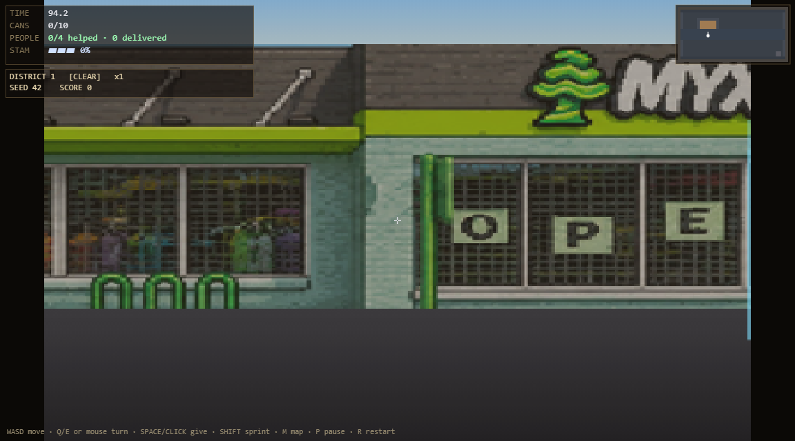
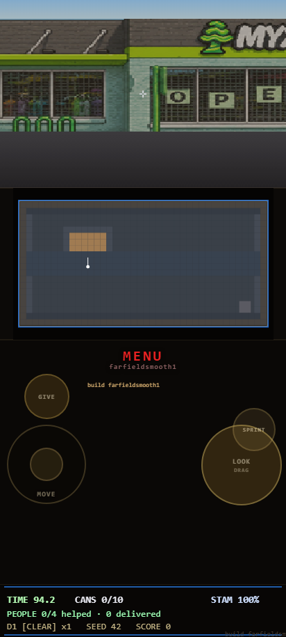

# Solidarity Not Charity Can Run

<p align="center">
  
</p>

<p align="center">
  <a href="https://falloutmule.github.io/solidarity-not-charity-can-run/"><strong>Play now</strong></a>
  ·
  <a href="PROJECT_STATUS.md">Project status</a>
  ·
  <a href="docs/design/GAME-DESIGN.md">Game design</a>
  ·
  <a href="docs/development/ROADMAP.md">Roadmap</a>
</p>

[](https://github.com/falloutmule/solidarity-not-charity-can-run/actions/workflows/selfcheck.yml)

**SNC Can Run** is a portrait-first, first-person route-running game about gathering canned goods and completing community distribution routes with speed, clarity, and solidarity.

The playable pre-alpha uses a custom raycaster and ships as one self-contained HTML file. No runtime JavaScript, CSS, fonts, images, or other assets are fetched from external services.

## The run

- Move through a stylized local neighborhood.
- Collect canned goods automatically as you reach them.
- Deliver supplies deliberately to community members.
- Learn the route, improve your time, and build toward a nine-level campaign.
- Help without combat, lives, or a savior narrative.

## Current state

The current public build is `inputcadence2` at a 400×250 internal render resolution with interpolated angles and subpixel projection.

The foundation, authored District 1 content, controls, saving, minimap, and single-file build pipeline are playable. The approved campaign and progression design are not yet fully implemented. Gameplay content remains paused while the Samsung frame-pacing investigation distinguishes delayed LOOK events from delayed rendered camera updates; the rejected 320×200 mode will not return as a default.

See [PROJECT_STATUS.md](PROJECT_STATUS.md) for the exact boundary between implemented, partial, and planned work.

## Controls

| Mobile | Desktop |
|---|---|
| Left control: move | `WASD` or arrow keys: move |
| Right control: look | Mouse or pointer drag: look |
| GIVE: deliver | Action controls shown in game |
| SPRINT: run faster | Sprint control shown in game |

<p align="center">
  
</p>

## Develop locally

```powershell
npm.cmd ci
New-Item -ItemType Directory -Force test-results/selfcheck-runs/local-release | Out-Null
$env:CR_SELFCHECK_RUN_DIR = 'test-results/selfcheck-runs/local-release'
npm.cmd run test:metadata-truth
npm.cmd run build:check
npm.cmd run test:farfield-final-smoke -- --output=test-results/local-release/farfield-final-smoke.json
```

Edit canonical inputs under `src/`, then rebuild the root `index.html`. Do not hand-edit the generated release artifact.

## Project guide

| Document | Purpose |
|---|---|
| [Game design](docs/design/GAME-DESIGN.md) | Approved product direction and design rules |
| [Architecture](docs/development/ARCHITECTURE.md) | Runtime, source, and build boundaries |
| [Roadmap](docs/development/ROADMAP.md) | Ordered work and explicit user gates |
| [Testing](docs/development/TESTING.md) | Release checks and characterization policy |
| [Performance](docs/development/PERFORMANCE.md) | Current Samsung evidence and next experiment |
| [Contributing](CONTRIBUTING.md) | Branch, change, and verification expectations |

## Rights

The repository is public for viewing and collaboration, but it is **not open source**. No reuse license is granted. See [RIGHTS.md](RIGHTS.md).
